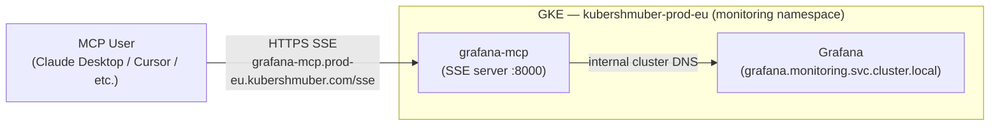

# grafana-mcp

Runs the [Grafana MCP server](https://github.com/grafana/mcp-grafana) on the `kubershmuber-prod-eu` cluster in the `monitoring` namespace, alongside the Grafana instance.

The server is configured to expose the following tool categories via `ENABLED_TOOLS`, backed by Grafana's Loki datasource. See the [mcp-grafana tool reference](https://github.com/grafana/mcp-grafana#tools) for full details on each tool.

| Category | Tools |
|---|---|
| `loki` | `query_loki_logs`, `list_loki_label_names`, `list_loki_label_values`, `query_loki_stats`, `query_loki_patterns` |
| `datasource` | `list_datasources`, `get_datasource` |
| `sift` | `list_sift_investigations`, `get_sift_investigation`, `get_sift_analysis`, `find_error_pattern_logs`, `find_slow_requests` |

## Architecture



## Grafana token (per user)

Authentication uses a [MCP Client Service Account](https://grafana.prod-eu.kubershmuber.com/org/serviceaccounts/39) (Viewer role). Each team member gets their **own individual token** under this service account — tokens are not shared between users, so each person's access can be tracked and revoked independently.

**To request a token**, ask in the **#devops** Slack channel.

**If you have token manager access** and need to create a token for someone:

1. Go to the [grafana-mcp service account](https://grafana.prod-eu.kubershmuber.com/org/serviceaccounts/39)
2. Click **Add service account token**
3. Set the token name to the person's name/username for tracking
4. Set an expiry if desired, click **Generate token**, and share it securely

## Connecting

The MCP server is available via SSE at:

```
https://grafana-mcp.prod-eu.kubershmuber.com/sse
```

> **You must be on an allowed IP to connect** — see [Architecture](#architecture) above.

**Claude Code:**

```bash
claude mcp add --transport sse grafana https://grafana-mcp.prod-eu.kubershmuber.com/sse
```

**OpenCode** (`opencode.json` or `~/.config/opencode/opencode.json`):

```json
{
  "mcp": {
    "grafana": {
      "type": "remote",
      "url": "https://grafana-mcp.prod-eu.kubershmuber.com/sse",
      "enabled": true
    }
  }
}
```

## Deployment

Deployed to prod EU via Cloud Build using the `deployment-chart` helm chart:

```
cd-assets/prod/cloudbuild_release_eu.yaml
```

The upstream `mcp/grafana` image is mirrored to the internal Artifact Registry before deploying:

```
europe-docker.pkg.dev/sports-dev-experiments/eu/mcp/grafana
```

## Configuration

| Variable | Value |
|---|---|
| `GRAFANA_URL` | `http://grafana.monitoring.svc.cluster.local` |
| `ENABLED_TOOLS` | `loki,datasource,sift` |
| `GRAFANA_SERVICE_ACCOUNT_TOKEN` | KMS-encrypted, injected at deploy time |
