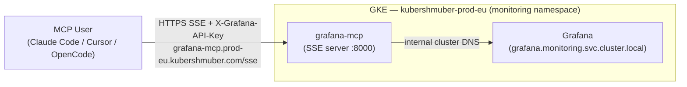

# grafana-mcp test

Runs the [Grafana MCP server](https://github.com/grafana/mcp-grafana) on the `kubershmuber-prod-eu` cluster in the `monitoring` namespace, alongside the Grafana instance.

The server is configured to expose the following tool categories via `ENABLED_TOOLS`, backed by Grafana's Loki datasource. See the [mcp-grafana tool reference](https://github.com/grafana/mcp-grafana#tools) for full details on each tool.

| Category | Tools |
|---|---|
| `loki` | `query_loki_logs`, `list_loki_label_names`, `list_loki_label_values`, `query_loki_stats`, `query_loki_patterns` |
| `datasource` | `list_datasources`, `get_datasource` |
| `sift` | `list_sift_investigations`, `get_sift_investigation`, `get_sift_analysis`, `find_error_pattern_logs`, `find_slow_requests` |

## Architecture



## Grafana token (per user)

Each user authenticates with their own token, passed via the `X-Grafana-API-Key` request header. The server forwards it to Grafana on every request — no shared tokens.

All tokens live under the shared **MCP Client Service Account** — one token per user, all under the same service account.

1. Go to [Service Accounts](https://grafana.prod-eu.kubershmuber.com/org/serviceaccounts) in Grafana and open the **MCP Client Service Account**
2. Click **Add service account token**
3. Set a name (e.g. your name), set an expiration date no longer than 1 year for security, click **Generate token**, and copy it immediately

## Connecting

The MCP server is available via SSE at:

```
https://grafana-mcp.prod-eu.kubershmuber.com/sse
```

**Claude Code:**

```bash
claude mcp add grafana https://grafana-mcp.prod-eu.kubershmuber.com/sse --transport sse --header "X-Grafana-API-Key: <your-token>"
```

**OpenCode** (`opencode.json` or `~/.config/opencode/opencode.json`):

```json
{
  "mcp": {
    "grafana": {
      "type": "remote",
      "url": "https://grafana-mcp.prod-eu.kubershmuber.com/sse",
      "headers": {
        "X-Grafana-API-Key": "<your-token>"
      },
      "enabled": true
    }
  }
}
```

**Cursor** (`~/.cursor/mcp.json` or `.cursor/mcp.json` in project root):

```json
{
  "mcpServers": {
    "grafana": {
      "url": "https://grafana-mcp.prod-eu.kubershmuber.com/sse",
      "headers": {
        "X-Grafana-API-Key": "<your-token>"
      }
    }
  }
}
```

## Deployment

Deployed to prod EU via Cloud Build using the `deployment-chart` helm chart:

```
cd-assets/prod/cloudbuild_release_eu.yaml
```

The upstream `mcp/grafana` image is mirrored to the internal Artifact Registry before deploying:

```
europe-docker.pkg.dev/sports-dev-experiments/eu/mcp/grafana
```

## Configuration

| Variable | Value |
|---|---|
| `GRAFANA_URL` | `http://grafana.monitoring.svc.cluster.local` |
| `ENABLED_TOOLS` | `loki,datasource,sift` |
